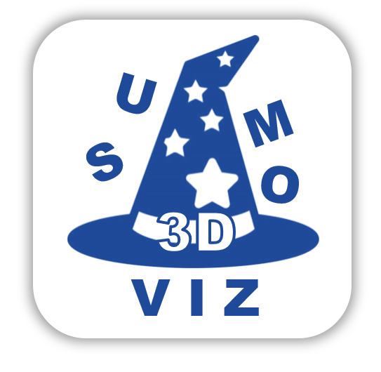
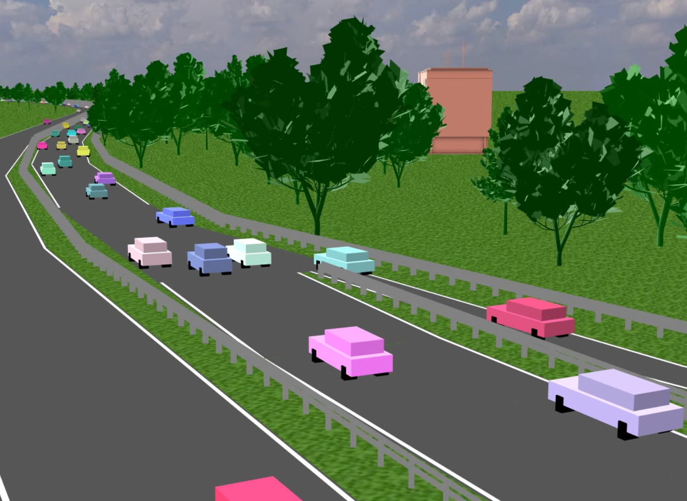
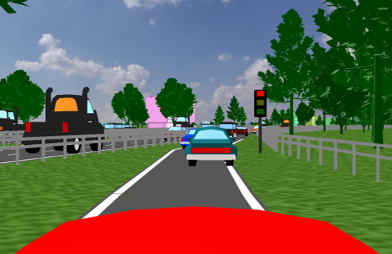
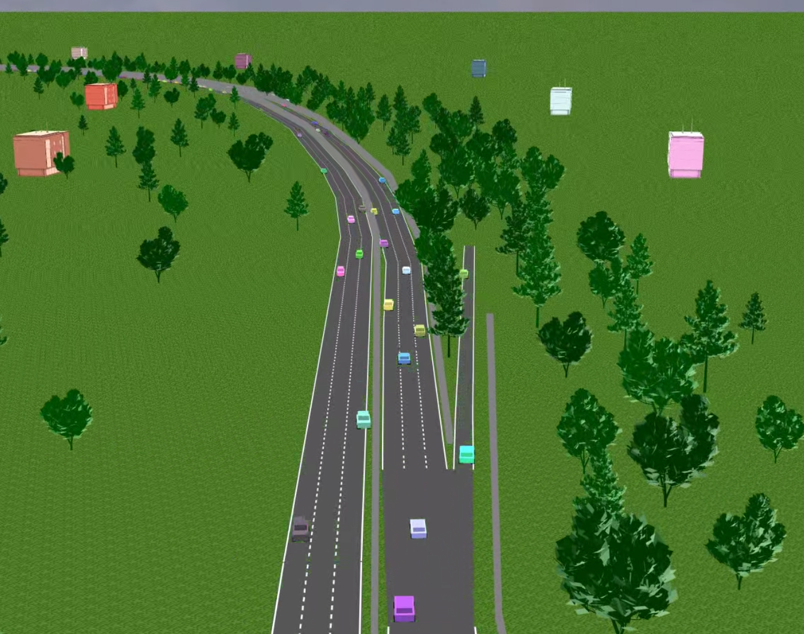
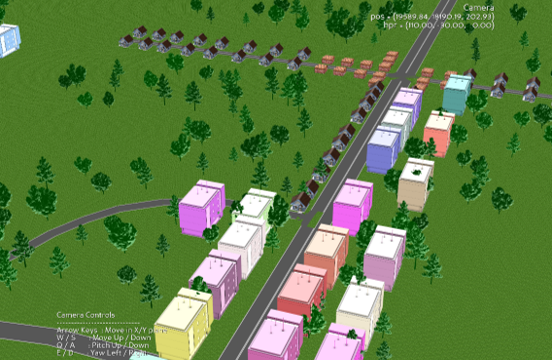
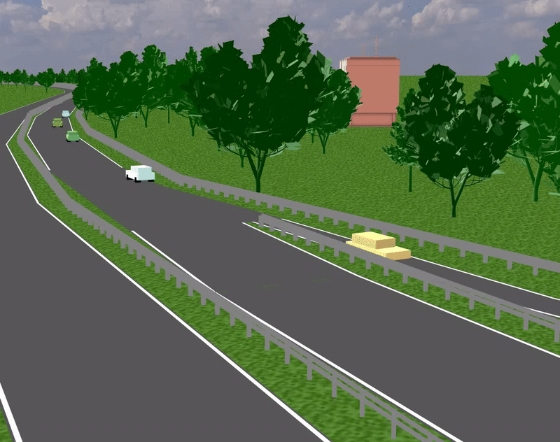

<h1>
    <center>
    <table width="100%">
        <tr>
            <td align="center">
                
                sumo3Dviz 
            </td>
        </tr>
        <tr>
            <td align="center">
                A three dimensional traffic visualisation
            </td>
        </tr>
    </table>
    </center>
</h1>

**sumo3Dviz** is a lightweight, open-source 3D visualisation pipeline for SUMO traffic simulations.
It converts standard SUMO simulation outputs, such as vehicle trajectories and signal states, into high-quality 3D renderings using a Python-based framework.

<table>
    <tr>
        <td><b>Features:</b></td>
        <td></td>
        <td>Major OS Support</td>
        <td></td>
        <td>Python 3.9 Support</td>
    </tr>
</table>

<details>
<summary><strong>Table of Contents</strong></summary>

- [Highlights](#highlights)
- [Installation](#installation)
- [Usage](#usage)
  - [Command Line Interface (CLI)](#command-line-interface-cli)
  - [Python Code](#python-code)
- [Case Study: Barcelona](#case-study-barcelona)
  - [Step 1: Prepare Sumo Simulation](#step-1-prepare-sumo-simulation)
  - [Step 2: Prepare Visualisation Configuration](#step-2-prepare-visualisation-configuration)
  - [Step 3: Render Video Visualisation with sumo3Dviz](#step-3-render-video-visualisation-with-sumo3dviz)
- [Citations](#citations)
</details>

## Highlights

<table>
    <tr>
        <td colspan="4"><b><center>Visualisation Modes</center></b></td>
    </tr>
    <tr>
        <td><center>(1) Eulerian</center></td>
        <td><center>(2) Lagrangian</center></td>
        <td><center>(3) Cinematic</center></td>
        <td><center>(4) Interactive</center></td>
    </tr>
    <tr>
        <td></td>
        <td></td>
        <td></td>
        <td></td>
    </tr>
    <tr>
        <td></td>
        <td></td>
        <td></td>
        <td></td>
    </tr>
</table>

Video Demos on YouTube:

- https://www.youtube.com/watch?v=wEUbjlqigyg
- https://www.youtube.com/watch?v=dq9pH1Cj7gA
- https://www.youtube.com/watch?v=XvpG5cbv7Ig

## Installation

The python package **sumo3Dviz** can be installed using pip:

```bash
pip install sumo3Dviz
```

**Please note:**
Currently only Python 3.9 is supported on all major operating systems (Windows, Mac iOS, Linux).

## Usage

You can use sumo3Dviz as command line tool (CLI), configure a variety of parameters in the config YAML file, and the run four different visualisation modes:

1. Run sumo3Dviz in Eulerian mode:

```
sumo3Dviz --config config.yaml --mode eulerian --output vid_eul.avi
```

2. Run sumo3Dviz in Lagrangian mode:

```
sumo3Dviz --config config.yaml --mode lagrangian --output vid_lag.avi
```

3. Run sumo3Dviz in Cinematic mode:

```
sumo3Dviz --config config.yaml --mode cinematic --output vid_cin.avi
```

4. Run sumo3Dviz in Interactive mode:

```
sumo3Dviz --config config.yaml --mode interactive
```

## Case Study: Barcelona

### Step 1: Prepare Sumo Simulation

You can run any SUMO simulation and render it to a video.
Just make sure to log vehicle positions and traffic lights (if desired for rendering).
Also, if you want to place trees, fences, buildings, and other objects, please create polygon files with netedit.
In the following explanations how to do it.
Moreover, we provide an example (barcelona_simulation) that demos all outlined information.

(1) **Log Vehicle Positions in your `Configuration.sumocfg`:**

```xml
<!-- YOUR Configuration.sumocfg -->
<?xml version="1.0" encoding="UTF-8"?>
<configuration xmlns:xsi="http://www.w3.org/2001/XMLSchema-instance" xsi:noNamespaceSchemaLocation="http://sumo.dlr.de/xsd/sumoConfiguration.xsd">

    <!-- ... -->

    <!-- INSERT THIS TO LOG VEHICLE POSITIONS -->
    <output>
        <fcd-output value="simulation_logs/vehicle_positions.xml"/>
        <fcd-output.attributes value="x,y,angle"/>
    </output>

    <!-- ... -->

</configuration>
```

(2) (Optional) **Log Traffic Light States `Configuration.sumocfg`:**

```xml
<!-- YOUR Configuration.sumocfg -->
<?xml version="1.0" encoding="UTF-8"?>
<configuration xmlns:xsi="http://www.w3.org/2001/XMLSchema-instance" xsi:noNamespaceSchemaLocation="http://sumo.dlr.de/xsd/sumoConfiguration.xsd">

    <!-- ... -->

    <!-- INSERT THIS TO LOAD ADDITIONAL FILE tls_logging.add.xml -->
    <input>
		<additional-files value="tls_logging.add.xml"/>
    </input>

    <!-- ... -->

</configuration>
```

And create the additional file `tls_logging.add.xml` in the same folder:

```xml
<?xml version="1.0" encoding="UTF-8"?>
<additional>
    <timedEvent type="SaveTLSStates"
                dest="simulation_logs/signal_states.xml"/>
</additional>
```

(3) (Optional) **Additional Objects (Fences, Trees, Buildings...):**

You can create polygon files (POIs) with Netedit, and store them, for example following `trees.add.xml`:

```xml
<additional xmlns:xsi="http://www.w3.org/2001/XMLSchema-instance" xsi:noNamespaceSchemaLocation="http://sumo.dlr.de/xsd/additional_file.xsd">
    <!-- Shapes -->
    <poi id="poi_0" color="red" layer="202.00" x="19332.99" y="17853.26"/>
    <poi id="poi_1" color="red" layer="202.00" x="19398.22" y="17894.70"/>
    <poi id="poi_10" color="red" layer="202.00" x="19412.72" y="17919.65"/>
    <poi id="poi_100" color="red" layer="202.00" x="18935.17" y="17729.96"/>
    <poi id="poi_1000" color="red" layer="202.00" x="20139.72" y="18631.08"/>
    <poi id="poi_1001" color="red" layer="202.00" x="20154.28" y="18637.80"/>
    <poi id="poi_1002" color="red" layer="202.00" x="20205.22" y="18645.08"/>
    <poi id="poi_1003" color="red" layer="202.00" x="20209.14" y="18647.88"/>
    <!-- ... -->
```

The simulation's input files (network, POIs), and the generated output log files are then processed by **sumo3Dviz** to generate the visualisation.

### Step 2: Prepare Visualisation Configuration

### Step 3: Render Video Visualisation with sumo3Dviz

#### Command Line Interface (CLI)

```bash
sumo3Dviz --config path/to/your/configuration.yaml
```

#### Python Code

In this repository we provide four example codes to run sumo3Dviz in the four different modes, that can be found in `.examples/`. These examples visualize the aforementioned case study of Barcelona.

1. Run sumo3Dviz in Eulerian mode:

```
python examples/demo_eulerian.py
```

2. Run sumo3Dviz in Lagrangian mode:

```
python examples/demo_lagrangian.py
```

3. Run sumo3Dviz in Cinematic mode:

```
python examples/demo_cinematic.py
```

4. Run sumo3Dviz in Interactive mode:

```
python examples/demo_interactive.py
```

# USAGE

## Option 1: CLI usage (after installation through pip)

```bash
pip install sumo3Dviz
sumo3Dviz --config path/to/your/configuration.yaml
```

To run the example provided in the repository, you can run

```bash
sumo3Dviz --config examples/config_barcelona.yaml
```

## Option 2: Module-based usage (after installation through pip)

Import the relevant modules and run the rendering mechanism as demonstrated in the `render_barcelona.py` script:

```bash
pip install sumo3Dviz
python examples/render_barcelona.py
```

## Citations

Please cite our paper if you find sumo3Dviz useful:

```
@inproceedings{riehl2026sumo3Dviz,
  title={sumo3Dviz: A three dimensional traffic visualisation},
  author={Riehl, Kevin and Schlapbach, Julius and Kouvelas, Anastasios and Makridis, Michail A.},
  booktitle={SUMO Conference Proceedings},
  year={2026}
}
```
